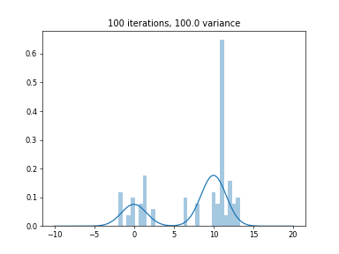
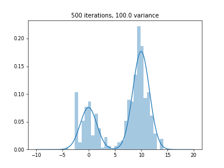
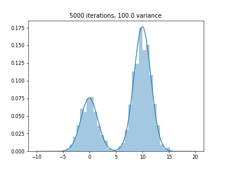

# Markov Chain Monte Carlo methods

This repository replicates the figures from [C. Andrieu's et al. tutorial on MCMC methods](https://link.springer.com/article/10.1023/A:1020281327116).

## The Metropolis-Hastings algorithm

 

